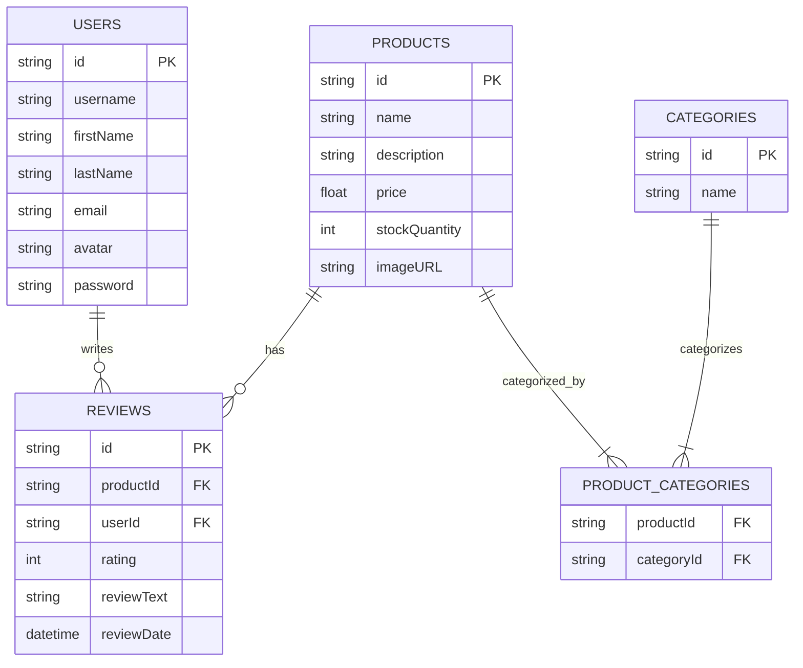

# Contributing

## Trello Board

The backlog for this repo is available as a
[Trello board](https://trello.com/b/xKHlc7Xy/nozama). This is a public template.

- [ ] One person on your team should create a new board from this template

- [ ] Then add the rest of your team as members.

You can then use this board to track your progress throughout the workshop.

## API Documentation

The [API documentation](https://nozama-api.netlify.app/) contains information
about the endpoints that this project is planning to expose. You can use this to
understand the inputs and outputs of each endpoint.

This documentation gives you an idea of what the API will look like when it is
complete, and will be a useful reference as you work on the database and
creating the API itself.

## Database schema

This diagram will help you understand how the different tables in the database
are related to each other, and what data is stored in each table.



## Merge conflicts

Merge conflicts are inevitable, but to help avoid them:

- communicate and plan to avoid people working on the same files

- don't push to `main` - use branches and pull requests

- pull frequently with `git pull origin main` to make sure your branch stays up
  to date and you integrate others' changes early

- push to your branch frequently with `git push` so others are aware of changes
  you have made

## Testing the model layer

There are some tests for the model layer which you can run with

```bash
npm run test:models
```

If you want to focus on, for example, just the `User` model, you can replace the
top-level `describe` in `Review.test.js` with `xdescribe` and these tests will
be skipped.

> [!IMPORTANT]
>
> The tests don't pass individual parameters to the models, like
> `User.create(firstName, lastName)`. Instead, they pass a single object, like
> `User.create(newUser)`.
>
> When writing the `User.create(newUser)` method, you should use
> `newUser.firstName` and so on.

## Backlog

Visit `TODO.md` to find out what's on the backlog - all the workshop details can
be found here.
