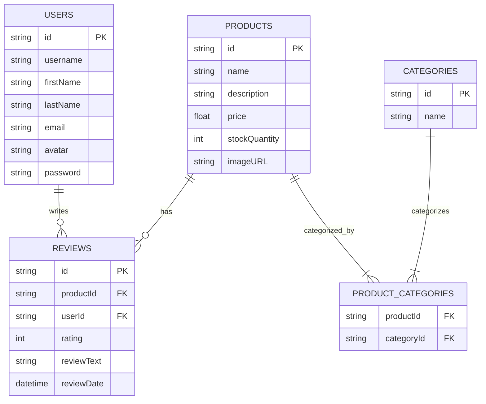

# Contributing

## Trello Board

The backlog for this repo is available as a
[Trello board](https://trello.com/b/xKHlc7Xy/nozama). This is a public template.

1. One person on your team should create a new board from this template

2. Then add the rest of your team as members.

You can then use this board to track your progress throughout the workshop.

## Database schema

This diagram will help you understand how the different tables in the database
are related to each other, and what data is stored in each table.

## API Documentation

The [API documentation](https://nozama-api.netlify.app/) contains information
about the endpoints that this project is planning to expose. You can use this to
understand the inputs and outputs of each endpoint.

This documentation gives you an idea of what the API will look like when it is
complete, and will be a useful reference as you work on the database and
creating the API itself.

## Workshops

## Day 1

Focus on completing the model layer for the application.

Choose an item from the Trello board move it to doing, so your teammates know
which items are being worked on. You can also assign the card to yourself.

Each item has a checklist. You won't be able to fully complete any cards today
because they involve adding API endpoints, which we'll be learning about
tomorrow. However, once you're done with the model layer of your chosen card,
you can move the card to "Blocked" and pick up a new one.

## Day 2

We're ready to start adding endpoints to our application.

You probably have a few cards in the "Blocked" column. Today, you'll be
finishing them off. Take a card from "Blocked" and put it in "Doing".

When you're done with a card, use the "Review" and "Done" columns to help
organise your teamwork.

## Day 3

This workshop is all about refactoring to improve our app. Based on what you've
learned today, feel free to add new cards to the backlog and then follow the
same process as the previous days to complete them.

Some things you might want to consider:

- Using custom errors and error handling

- Splitting the API into separate route files

- Adding validation to the API

- Adding new endpoints to the API

- Adding more test coverage
