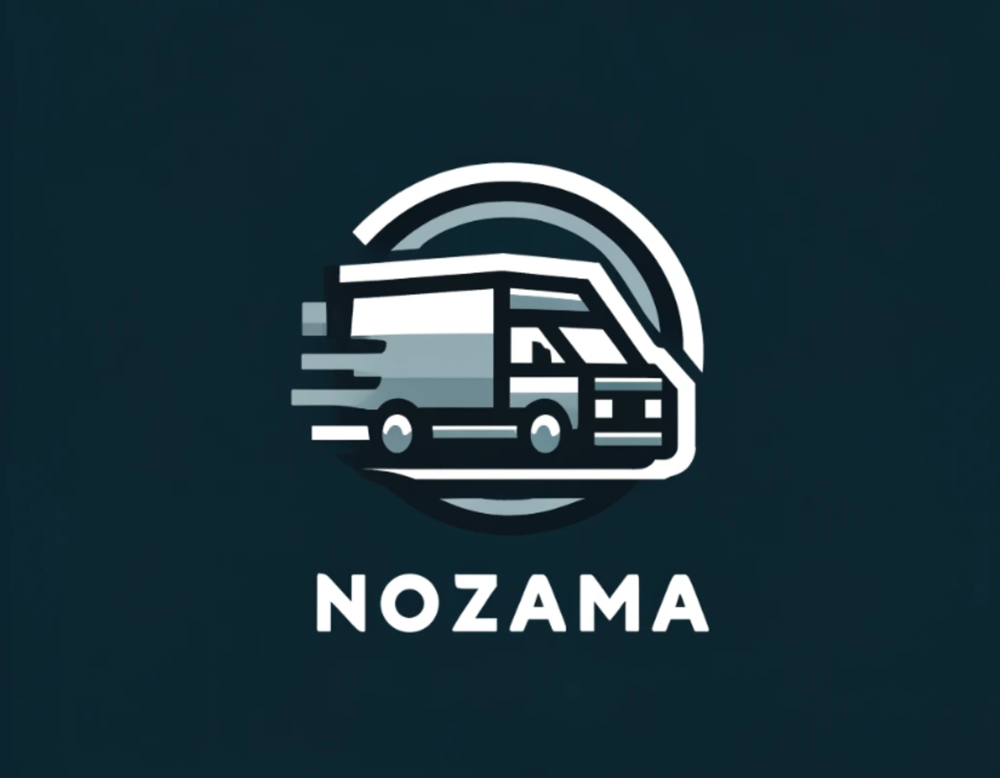
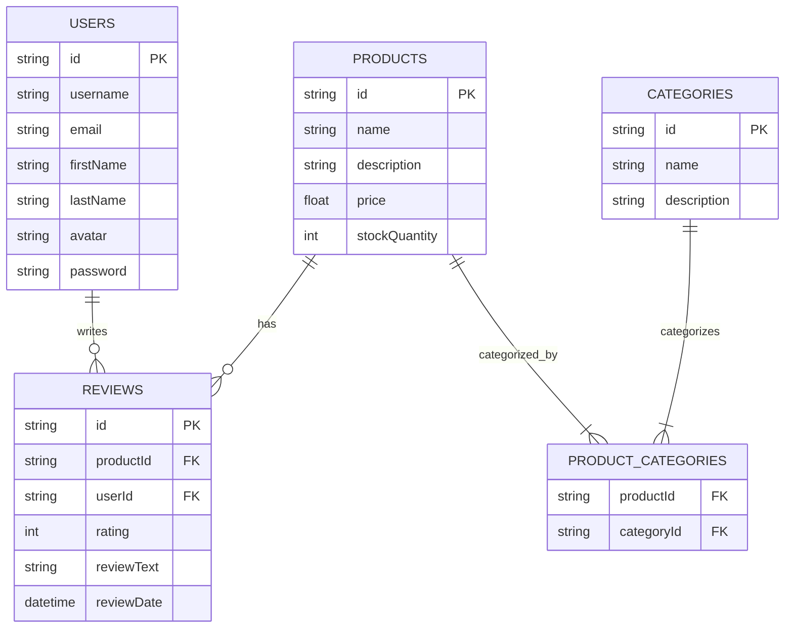

<p align="center">
  
</p>

# Nozama

Welcome to Nozama!

Nozama is a world-class e-commerce platform that allows users to browse and
purchase products from a wide range of categories. Users can also leave reviews
on products they have purchased, and view reviews left by other users.

This repo contains the source code for the Nozama backend, which is built using
Node.js, Express, and Knex. It is an API which allows developers to interact
with the Nozama database, so they can build their own applications on top of it.

Please note that this repo is for learning purposes. It contains plenty of bad
security practices, and should not be used in production.

## Database schema

This diagram will help you understand how the different tables in the database
are related to each other, and what data is stored in each table.



## API Documentation

The [API documentation](https://nozama-api.netlify.app/) contains information
about the endpoints that this project is planning to expose. You can use this to
understand the inputs and outputs of each endpoint.

This documentation gives you an idea of what the API will look like when it is
complete, and will be a useful reference as you work on the database and
creating the API itself.

## Getting started

1. Fork this repo. If working in a team, make sure to add your teammates as
   collaborators on your fork.

2. Clone the repo and install dependencies:

   ```
   npm install
   ```

## Deep dive

Take a look in the `exercises` directory for information on the deep dives. As
usual, Day 1 Exercise 1 is labeled `d1e1` and can be tested with
`npm run test:d1e1`.

You will find documentation URLs in the exercise files.

### Day 1

These exercises guide you through setting up the connection to the database, and
creating the first few model methods.

### Day 2

The exercises give you some practice creating and configuring an Express app.
